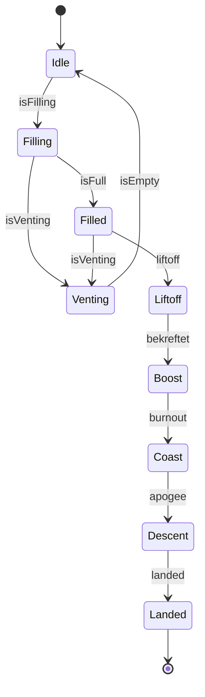

# Flight-computer-26-27

Flygecomputer for rakettsesongen 26/27. Den leser sensorer, bestemmer hvilken fase raketten er i, logger alt til SD-kort og sender telemetri til bakken. Den styrer ingenting fysisk: recovery er et separat system, og motoren bare overvåkes.

## Tilstandsmaskin

`FlightStateMachine` bestemmer fasen ut fra `VehicleState` (høyde, fart, akselerasjon) og `MotorState` (tanktrykk, kammertrykk, temperatur, ventil).



### Overganger

| Fra → til | Betingelse | Kilde |
|---|---|---|
| Idle → Filling | Tanktrykket stiger over omgivelsestrykk + margin | `FillDetector::isFilling` |
| Filling → Filled | Tanktrykket er over måltrykk og stabilt i noen sekunder | `FillDetector::isFull` |
| Filling/Filled → Venting | Tanktrykket faller jevnt | `VentDetector::isVenting` |
| Venting → Idle | Tanktrykket er tilbake nær omgivelsestrykk | `VentDetector::isEmpty` |
| Filled → Liftoff | Akselerasjon over terskel i N prøver på rad | `LiftoffDetector` |
| Liftoff → Boost | Kort tid etter liftoff (bekrefter liftoff) | Tid i fasen |
| Boost → Coast | Kammertrykket faller under terskel, eller akselerasjonen blir negativ, i N prøver på rad | `MotorState` / `VehicleState` |
| Coast → Descent | Farten er negativ i N prøver og høyden har falt fra toppen | `ApogeeDetector` |
| Descent → Landed | Farten ≈ 0 og høyden stabil i flere sekunder | `LandingDetector` |

Tersklene er ikke bestemt ennå. De skal justeres mot Simulink-modellen og motordataene.

**Husk å endre før flyging:**

- [ ] `FillDetector::Config::targetPa` er satt til 45 bar som en antagelse. Bytt til riktig måltrykk for motoren.
- [ ] `FillDetector::Config::ambientPa` er fast 101325 Pa. Sett den fra barometeret ved oppstart (når `StateEstimator` er på plass), siden omgivelsestrykket varierer med høyde og vær.
- [ ] `VentDetector::Config::ambientPa` har samme problem som `FillDetector`: fast 101325 Pa. Sett den fra barometeret.
- [ ] `VentDetector::Config`: lufting er foreløpig definert som minst 5 bar fall med minst 5 bar/s over minst 0,5 s. Tallene er gjettet. Bytt til verdier som passer ventilen og motoren.
- [ ] `LiftoffDetector::Config`: liftoff er foreløpig over 30 m/s² (ca. 3 g) i 5 prøver på rad. Sjekk mot motorens skyvekraftkurve at terskelen nås raskt, og at 5 prøver passer med tick-frekvensen.
- [ ] `ApogeeDetector::Config`: apogee er foreløpig negativ fart i 5 prøver og minst 2 m fall fra toppen. Juster `minDropM` etter støyen i høydeestimatet fra `StateEstimator`.
- [ ] Se over koden i `ApogeeDetector`. Kravene om negativ fart og fall i høyde er bare uavhengige hvis farten fra `StateEstimator` bruker IMU-en, ikke bare den deriverte av baro-høyden. Sjekk også at et trykkhopp i barometeret nær lydhastigheten ikke kan utløse apogee for tidlig.
- [ ] `FlightStateMachine::Config`: tidene er gjettet ut fra `FlightSim` (3 s brenntid). Sett `minBurnS` (tidligste normale burnout), `burnoutTimeoutS`, `apogeeTimeoutS` og `landingTimeoutS` fra Simulink-modellen, med god margin over forventet tid.
- [ ] `tools/telemetry_packet.py` legger motortemperaturen i `engine.tank_temp_c`. Sjekk at termoelementet faktisk sitter på tanken.
- [ ] Øvrige terskler i `FillDetector::Config` (margin, stabilt bånd, stabil tid) er foreløpige og skal justeres mot motordataene.

### Sikkerhetsregler

1. **Ingen vei tilbake etter liftoff.** Fra `Liftoff` og framover går fasen bare framover.
2. **Liftoff krever `Filled`.** Støt på rampa under fylling kan ikke utløse liftoff.
3. **Aldri stol på én måling.** Alle detektorene krever at betingelsen er sann flere prøver på rad.
4. **Reserve-tidsgrenser.** Hvis en detektor aldri trigger, tvinger en tidsgrense overgangen.
5. **Faseendringer logges alltid** med tidsstempel.

### Avvik

`FlightStateMachine` holder et sett med avviksflagg (`Anomaly`) som logges og sendes med telemetrien:

| Flagg | Betyr |
|---|---|
| `EarlyBurnout` | Burnout kom tidligere enn forventet |
| `ApogeeByTimeout` | Coast → Descent skjedde via tidsgrense, ikke `ApogeeDetector` |
| `LandingByTimeout` | Descent → Landed skjedde via tidsgrense, ikke `LandingDetector` |
| `SensorFault` | En sensor ga ugyldige verdier eller svarte ikke |
| `GpsLost` | Mistet GPS-posisjon under flyturen |
| `BurnoutByTimeout` | Boost → Coast skjedde via tidsgrense, verken kammertrykk eller akselerasjon viste burnout |

## Hva som skjer i hver tick

`FlightComputer::tick(dt)` kjøres med fast frekvens:

1. `HealthMonitor` sjekker sensorer og batteri
2. `StateEstimator` leser barometer, IMU og GPS, og lager `VehicleState` og `RawSensorData`
3. `MotorMonitor` lager `MotorState` fra motorsensorene
4. `FlightStateMachine` bestemmer fasen og setter eventuelle avvik
5. `DataLogger` skriver estimater og rådata til SD, og skriver en `Event` ved faseendring, nytt avvik og rampeslutt
6. `TelemetryEncoder` og `TelemetryLink` sender telemetri med fase, avvik og GPS-posisjon

## Telemetri

Hver pakke er 48 byte, little-endian, uten padding. Layouten står i `lib/core/TelemetryPacket.h`. Bakkestasjonen dekoder med `tools/telemetry_packet.py`, som lager én rad for `telemetry` og én for `engine` i Ground_station_backend. Endres layouten, må `TelemetryPacket::kVersion` økes og Python-filen endres likt. Testene på begge sider sjekker de samme 48 bytene, så de feiler hvis C++ og Python ikke er enige.

Pakken har `seq`, tid, fase, avvik, høyde, fart, akselerasjon, kammer- og tanktrykk, motortemperatur, ventil, GPS-posisjon, GPS-høyde og antall satellitter. Batterispenning er ikke med ennå, fordi ingen kode måler den.

### TODO i bakkestasjonen

Bakkestasjonen ligger i et eget repo (Ground_station_backend). Dette må endres der for at den skal passe med pakken:

- [ ] Ta i bruk `tools/telemetry_packet.py` (eller kopier den) i radiomottakeren som poster til `/sessions/{id}/telemetry` og `engine`.
- [ ] Legg til kolonnene `anomalies` (int, bitflagg fra `Anomaly.h`) og `gps_satellites` (int) i `TelemetryModel` og `TelemetryBase`. Dekoderen sender dem allerede, men de forsvinner til kolonnene finnes.
- [ ] `t_ms`: bakkestasjonen regner den som tid relativt til T0, men flygecomputeren sender tid siden oppstart. Bestem hvilken side som regner om. Det kan for eksempel gjøres ved å lagre tidspunktet for liftoff.
- [ ] `flight_state` er navnet på fasen fra `Phase.h` (`Idle`, `Filling`, `Filled`, `Venting`, `Liftoff`, `Boost`, `Coast`, `Descent`, `Landed`). Sjekk at dashboardet bruker de samme navnene.
- [ ] `pitch_deg`, `roll_deg`, `yaw_deg`, `pressure_hpa`, `temperature_c` og `battery_v` blir alltid `None`, fordi flygecomputeren ikke sender dem. Fjern dem, eller la dem stå til de blir målt.
- [ ] `engine.tank_temp_c` får motortemperaturen fra termoelementet. Bytt felt hvis termoelementet ikke sitter på tanken.

## Krav fra Luftfartstilsynet

[Veiledning for oppskyting av avanserte raketter](https://www.luftfartstilsynet.no/romfart/veiledninger-romfart/veiledning-for-oppskyting-av-avanserte-raketter/) stiller ingen direkte krav til flygecomputeren. Men rapporten etter flyturen og sikkerhetsdokumentasjonen krever data som bare flygecomputeren kan levere:

| Krav i veiledningen | Hvordan flygecomputeren dekker det |
|---|---|
| Data fra telemetri eller sporing som bekrefter faktisk bane og maksimal høyde | Høyde, fart og GPS-posisjon logges og sendes som telemetri |
| Søk etter raketten/rakettdelene etter oppskyting | GPS-posisjon i telemetrien |
| Hendelseslogg: kronologisk oversikt over operasjonen | `Event` for hver faseendring, avvik og rampeslutt, med tidsstempel |
| Beskrivelse av avvik fra plan | `Anomaly`-flagg |
| Validering av modeller og simuleringer | `RawSensorData` logges ved siden av estimatene, så flyturen kan sammenlignes med Simulink |
| Farer som skal vurderes: feiltenning, tidlig cutoff | Feiltenning: fasen blir stående i `Filled` til tanken luftes (`Venting`). Tidlig cutoff: `EarlyBurnout` |
| Avbruddsprosedyrer, inkludert tømming av drivstoff | `Venting`-fasen |
| Raketten må forlate rampa med minst 12–15 m/s | Hastigheten ved rampeslutt logges som `Event` (`RailExit`) |

Tennsystemet (sikkerhetsnøkkel, dead-man's switch, 60 sekunders venting ved feiltenning) er bakkeutstyr og ikke en del av denne koden.

## Mappestruktur

```
lib/hal/       grensesnitt mot maskinvare (IBarometer, IImu, IGps, IPressureSensor, ...)
lib/core/      all fly-logikk, uten Arduino-kode
lib/drivers/   drivere for ekte maskinvare (Bmp390, Vn100, GpsReceiver, SdLogger, ...)
src/main.cpp   kobler driverne inn i FlightComputer
test/          enhetstester, én test_*-mappe per modul (hver er et eget testprogram)
test/fakes/    falsk maskinvare og FlightSim
test/helpers/  felles testhjelpere (SimRig, motorAt, vehicleAt, ramp)
```

`core/` avhenger bare av grensesnittene i `hal/`. Derfor kan all logikken testes på PC-en, også med data fra Simulink.

## Bygge og teste

Krever [PlatformIO](https://platformio.org/).

Kjør testene på PC-en:

```bash
pio test -e native
```

Bygg for flygecomputeren:

```bash
pio run -e teensy41
```
